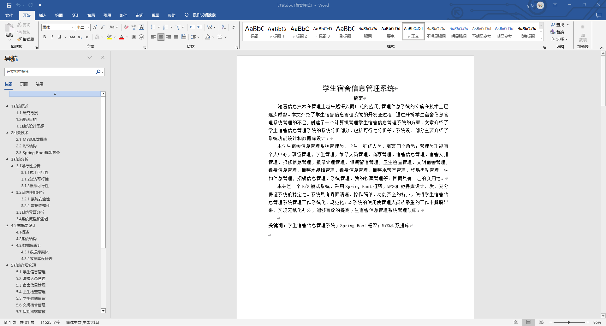
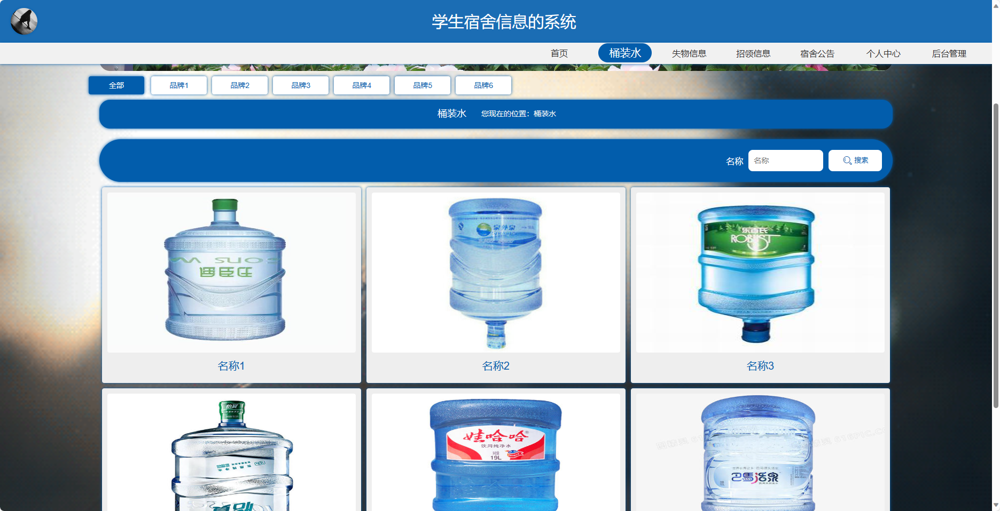
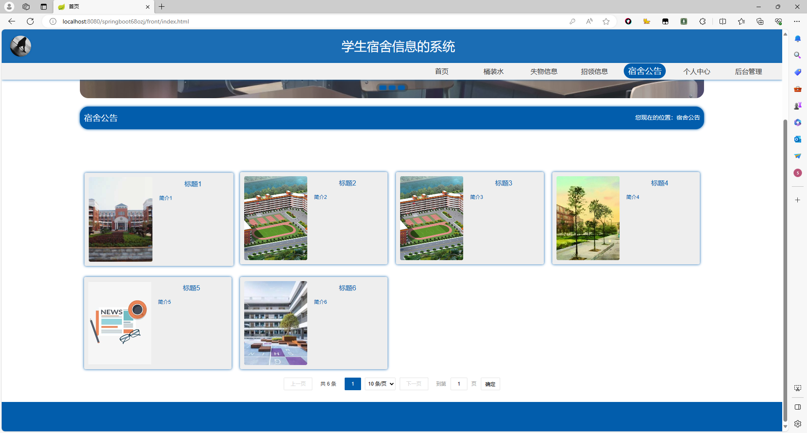
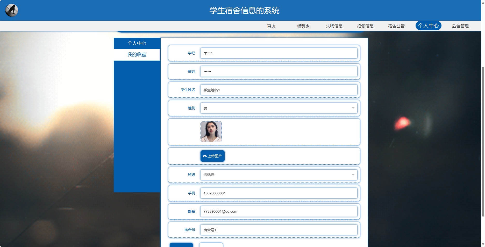
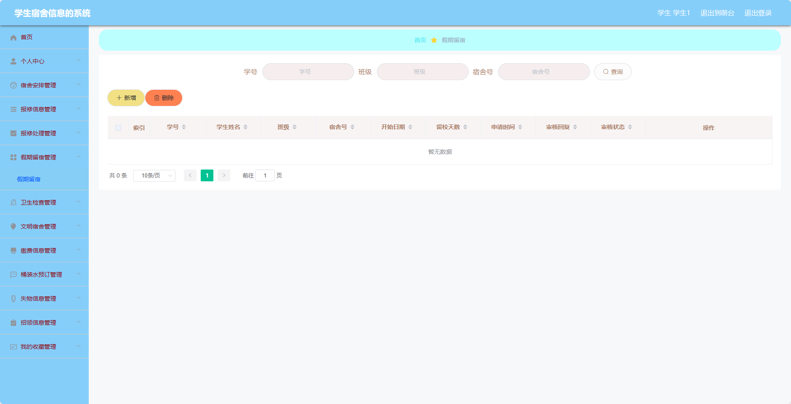
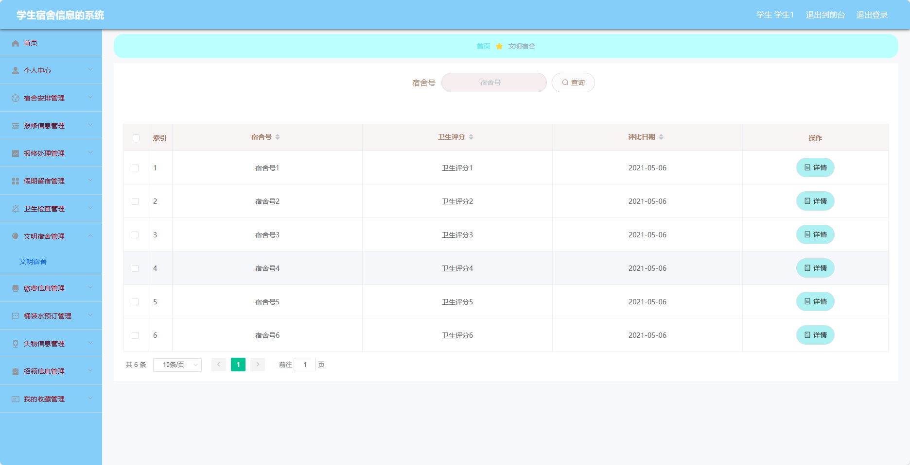
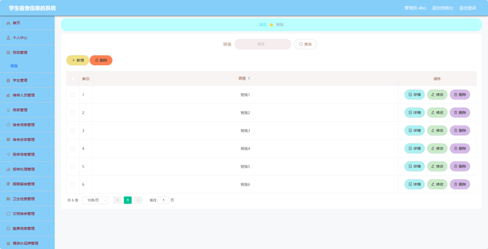
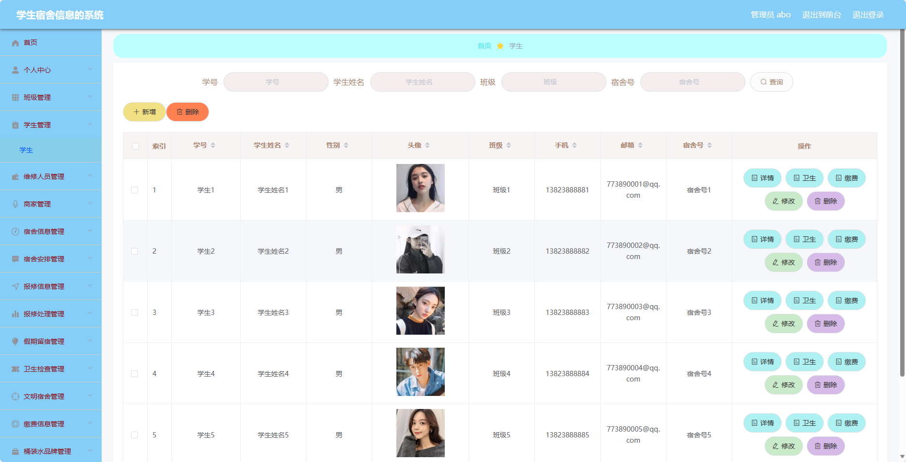

## 基于SpringBoot的学生宿舍信息系统(程序+报告)

###  获取sql数据库文件: 从戎源码网 (https://armycodes.com/) QQ: 386869957 QQ群: 377586148
###  所有系统地址: (https://github.com/YuLin-Coder/AllProjectCatalog) 
###  所有项目以及源代码本人均调试运行无问题 可支持远程安装部署调试、定制修改、代码讲解

## 项目介绍
基于SpringBoot的学生宿舍信息系统，系统包含三种角色：管理员、维修人员，商家，用户,系统分为前台和后台两大模块，主要功能如下。

### 【管理员】:
- 个人中心：管理员可以管理个人信息。
- 班级管理：管理员可以管理班级信息。
- 学生管理：管理员可以管理学生信息。
- 维修人员管理：管理员可以管理维修人员信息。
- 商家管理：管理员可以管理商家信息。
- 宿合信息管理：管理员可以查看和管理宿舍相关信息。
- 宿舍安排管理：管理员可以管理宿舍的分配情况。
- 报修信息管理：管理员可以查看和管理报修信息。
- 报修处理管理：管理员可以处理和跟进报修请求。
- 假期留宿管理：管理员可以管理假期留宿的相关信息。
- 卫生检查管理：管理员可以管理卫生检查的相关信息。
- 文明宿舍管理：管理员可以管理文明宿舍合规性。
- 缴费信息管理：管理员可以管理缴费信息。
- 桶装水品牌管理：管理员可以管理桶装水的品牌信息。
- 桶装水管理：管理员可以管理桶装水的具体信息。
- 桶装水预订管理：管理员可以管理桶装水的预订订单。
- 物品类别管理：管理员可以管理物品的分类信息。
- 失物信息管理：管理员可以发布和管理失物信息。
- 招领信息管理：管理员可以发布和管理招领信息。
- 系统管理：管理员可以管理系统的基本设置。

### 维修人员角色：
- 个人中心：维修人员可以管理个人信息。
- 报修信息管理：维修人员可以查看和处理报修信息。
- 报修处理管理：维修人员可以处理和跟进报修请求。

### 商家角色：
- 个人中心：商家可以管理个人信息。
- 桶装水管理：商家可以管理桶装水的信息。
- 桶装水预订管理：商家可以管理桶装水的预订订单。

### 【前台】:
- 首页：展示系统的概览信息和宿舍相关通知。
- 桶装水：用户可以查看桶装水的信息和进行预订。
- 失物信息：用户可以发布和查看失物信息。
- 招领信息：用户可以发布和查看招领信息。
- 宿舍公告：用户可以查看宿舍相关的公告信息。
- 个人中心：用户可以管理个人信息。

### 【用户】:
- 个人中心：用户可以管理个人信息。
- 宿舍安排管理：用户可以查看和管理宿舍的分配情况。
- 报修信息管理：用户可以提交和查看报修信息。
- 报修处理管理：用户可以查看和处理报修请求。
- 假期留宿管理：用户可以申请和查看假期留宿的相关信息。
- 卫生检查管理：用户可以查看卫生检查相关的信息。
- 文明宿合管理：用户可以查看和管理文明宿舍合规性。
- 缴费信息管理：用户可以查看和管理缴费信息。
- 桶装水预订管理：用户可以预订和管理桶装水的订单。
- 失物信息管理：用户可以发布和管理失物信息。
- 招领信息管理：用户可以发布和管理招领信息。
- 我的收藏管理：用户可以查看和管理自己的收藏信息。

## 项目技术
- 编程语言：Java
- 数据库：MySQL
- 项目管理工具：Maven
- 前端技术：HTML、CSS、JavaScript、Jquery、Vue
- 后端技术：Spring、SpringMVC、MyBatis

## 运行环境
- JDK版本：JDK1.8及以上
- 开发工具：IDEA、Ecplise、Myecplise都可以
- 数据库: MySQL5.7及以上
- Maven：maven3.0及以上
- Node：14.14.0及以上

## 运行截图

